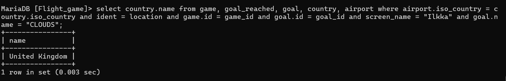

#Week3-Excercise 3

Nape Vithanage Chanika Anjalee

###Question 1 

select country.name as "country name", airport.name as "airport name"  from country, airport where airport.iso_country = country.iso_country and country.name = "Iceland";

###Question 2

select airport.name as "Airport Name" from airport, country where airport.iso_country= country.iso_country and country.name = "France" and airport.type = "large_airport";

###Question 3

select country.name as "country_name", airport.name as "airport_name" from airport,country where airport.iso_country = country.iso_country and country.continent = "An";

###Question 4

select elevation_ft from airport,game where game.location = ident and screen_name ="Heini";

###Question 5

select elevation_ft * 0.3048 as "elevation_m" from airport,game where game.location = ident and screen_name ="Heini";

###Question 6

select name from airport,game where location = ident and screen_name = "Ilkka";

###Question 7

select country.name from airport,country,game where airport.iso_country = country.iso_country and location = ident and screen_name = "Ilkka";

###Question 8

SELECT goal.name FROM goal INNER JOIN goal_reached ON goal.id = goal_reached.goal_id INNER JOIN game ON goal_reached.game_id = game.id WHERE game.screen_name = "heini";

###Question 9

select airport.name from game, goal_reached, goal, airport where ident = location and game.id = game_id and goal.id = goal_id and screen_name = "Ilkka" and goal.name = "CLOUDS";

###Question 10

select country.name from game, goal_reached, goal, country, airport where airport.iso_country = country.iso_country and ident = location and game.id = game_id and goal.id = goal_id and screen_name = "Ilkka" and goal.name = "CLOUDS";

