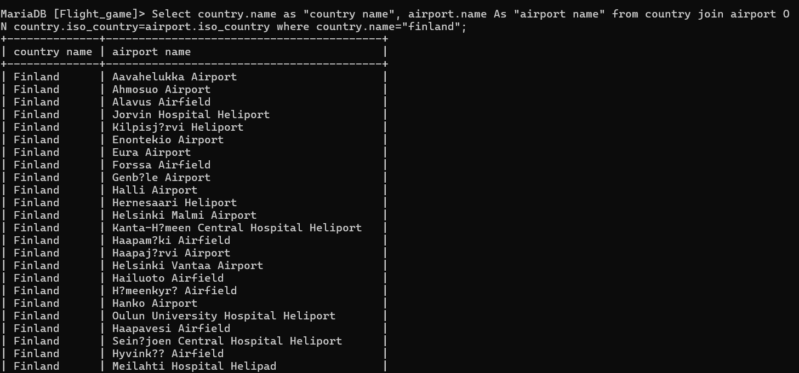
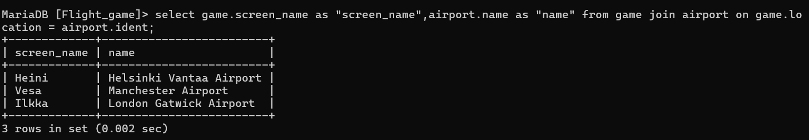
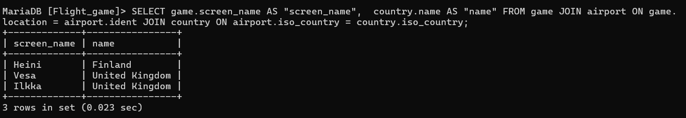
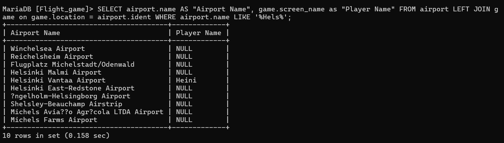
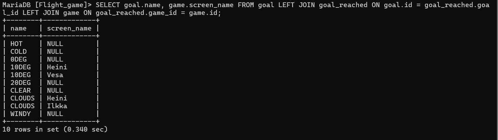

#Week4-Excercise 4

Nape Vithanage Chanika Anjalee

###Question 1 

Select country.name as "country name", airport.name As "airport name" from country join airport ON country.iso_country=airport.iso_country where country.name="finland";

###Question 2

select game.screen_name as "screen_name",airport.name as "name" from game join airport on game.location = airport.ident;

###Question 3

SELECT game.screen_name AS "screen_name",  country.name AS "name" FROM game JOIN airport ON game.location = airport.ident JOIN country ON airport.iso_country = country.iso_country;

###Question 4

SELECT airport.name AS "Airport Name", game.screen_name as "Player Name" FROM airport LEFT JOIN game on game.location = airport.ident WHERE airport.name LIKE '%Hels%';

###Question 5

SELECT goal.name, game.screen_name FROM goal LEFT JOIN goal_reached ON goal.id = goal_reached.goal_id LEFT JOIN game ON goal_reached.game_id = game.id;
