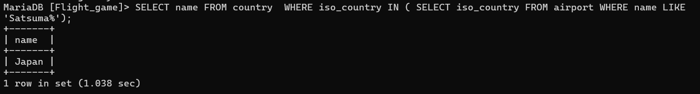
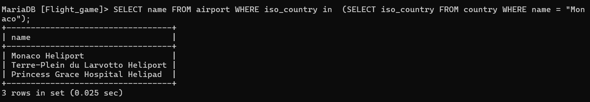
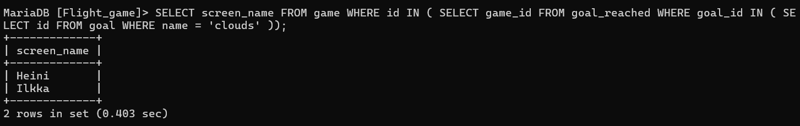
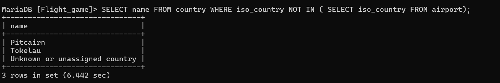
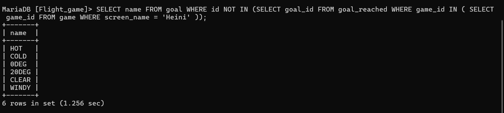

#Week4-Excercise 5

Nape Vithanage Chanika Anjalee

###Question 1 

SELECT name FROM country  WHERE iso_country IN ( SELECT iso_country FROM airport WHERE name LIKE 'Satsuma%');

###Question 2

SELECT name FROM airport WHERE iso_country in  (SELECT iso_country FROM country WHERE name = "Monaco");

###Question 3

SELECT screen_name FROM game WHERE id IN ( SELECT game_id FROM goal_reached WHERE goal_id IN ( SELECT id FROM goal WHERE name = 'clouds' ));

###Question 4

SELECT name FROM country WHERE iso_country NOT IN ( SELECT iso_country FROM airport);

###Question 5

SELECT name FROM goal WHERE id NOT IN (SELECT goal_id FROM goal_reached WHERE game_id IN ( SELECT game_id FROM game WHERE screen_name = 'Heini' ));
